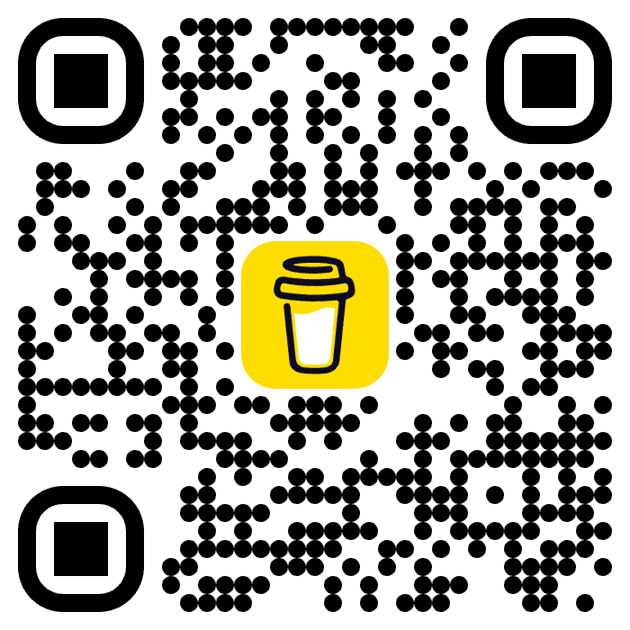

# Subtitle Ball

A universal floating-ball subtitle panel userscript for any website with an HTML5
video player. Load a local `.srt` file onto whatever video is on the page.

Everything runs locally in your browser. **No account, no network calls, no
telemetry.**

## Features

- Load a local `.srt` file and overlay it on the page's video element
- Draggable floating ball that remembers its position
- Subtitle appearance: colour, font size, vertical position
- Picture adjustment: brightness / contrast / saturation
- Hotkeys: skip, accelerate, picture adjustments, ESC to collapse
- Works on Chrome (Tampermonkey) and Safari (Userscripts)

## Hotkeys

| Key | Action |
|---|---|
| `z` | skip back |
| `x` | skip forward |
| `c` | accelerate (hold) |
| `w` / `e` | brightness − / + |
| `r` / `t` | contrast − / + |
| `y` / `u` | saturation − / + |
| `ESC` | collapse panel |

## Install

1. Install a userscript manager — [Tampermonkey](https://www.tampermonkey.net/)
   (Chrome/Edge/Firefox) or [Userscripts](https://apps.apple.com/us/app/userscripts/id1463298887)
   (Safari, macOS/iOS).
2. Open [`subtitle-ball.user.js`](https://raw.githubusercontent.com/neo2codes/subtitle-ball/main/subtitle-ball.user.js) and confirm the install prompt.
3. Visit any page with a video, and the subtitle ball appears.

## Support

Subtitle Ball is free and open source, and always will be. If you find it
useful, you can [buy me a coffee](https://buymeacoffee.com/neo2codes) to
support continued development. Donations are entirely optional — every feature
in this script is available without them.

  
   
  Scan to support on mobile

## Privacy

Nothing leaves your browser. All settings are stored in `localStorage` under the
`subtitleBall*` keys. There is no server, no analytics, and no third-party API.

## Licence

MIT.
